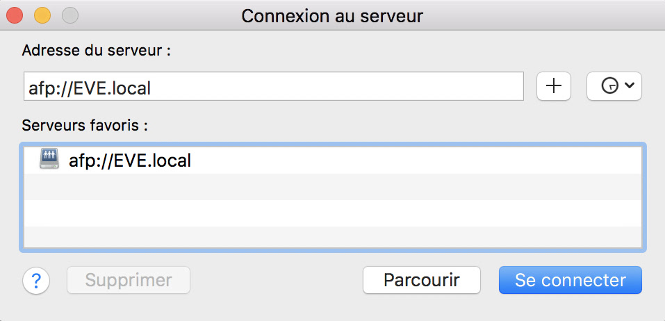
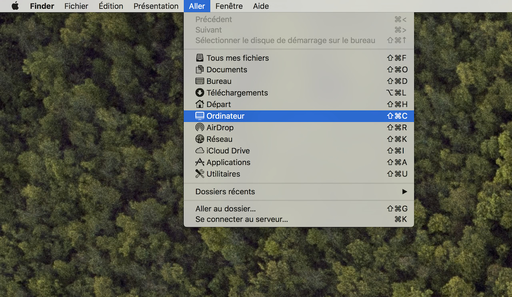
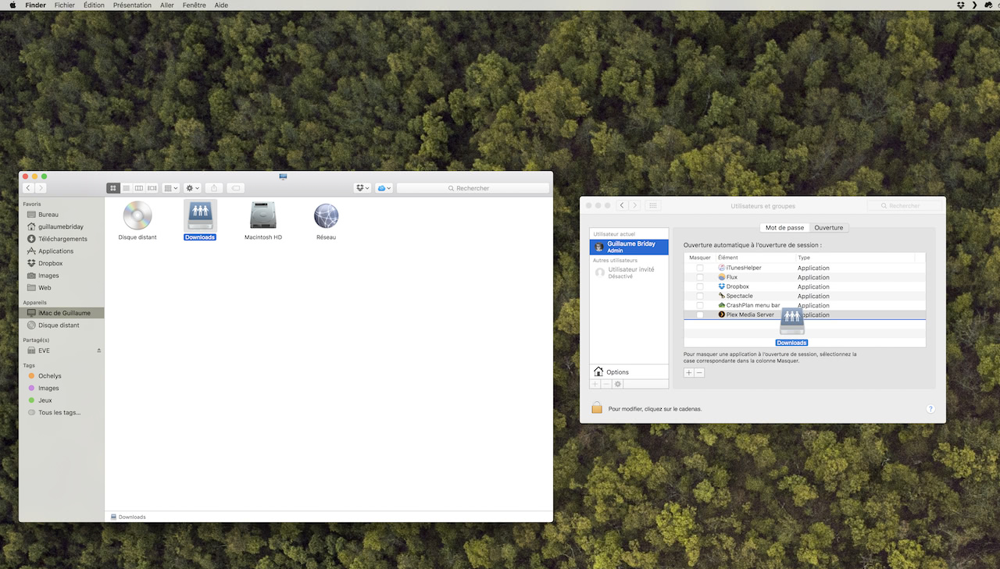

Si comme moi vous utilisez un disque en réseau (via un NAS par exemple) vous avez peut être envie de le voir apparaitre dans le Finder, comme un disque dur externe le ferait, au démarrage de votre ordinateur. Dans cet article, je vais prendre comme exemple mon cas d'utilisation donc avec un NAS connecté via AFP.

Tout d'abord, connectez-vous à votre disque de manière classique, vous pouvez ouvrir n'importe quelle fenêtre du Finder et faire le raccourci <kbd>⌘</kbd> + <kbd>k</kbd> pour faire cela.

Cette fenêtre devrait apparaître, entrez ensuite l'adresse du serveur ainsi que vos identifiants puis cliquez enfin sur "Se connecter".

Si tout s'est bien passé, vous pouvez maintenant vous rendre dans le dossier "Ordinateur" de votre Mac, avec le raccourci <kbd>⇧</kbd> + <kbd>⌘</kbd> + <kbd>c</kbd> ou via le lien dans le menu.

Ouvrez désormais vos Préférences Système et cherchez "ouverture".

Il suffit alors de tout simplement faire glisser le disque en réseau dans cette liste pour que OS X s'y reconnecte automatiquement au démarrage de votre session.

Et voilà, vous en avez terminé et vous pouvez désormais ne plus vous soucier de monter votre disque à chaque démarrage pour utiliser votre serveur Plex directement par exemple !

À bientôt :)
