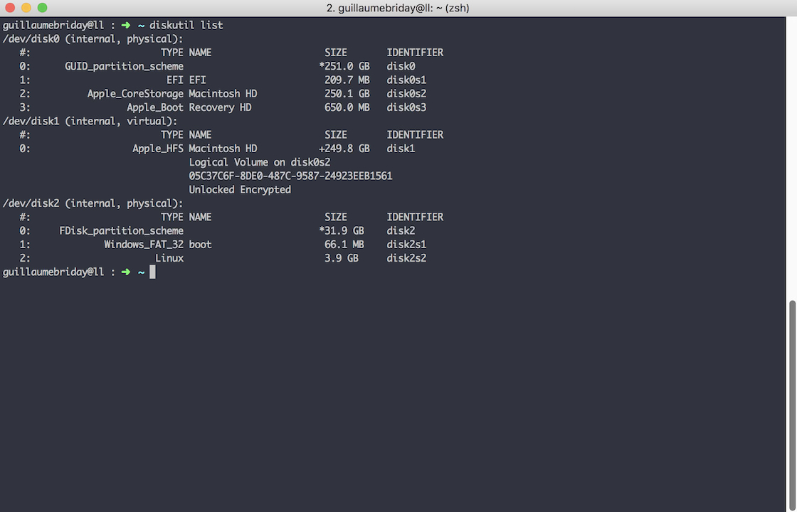
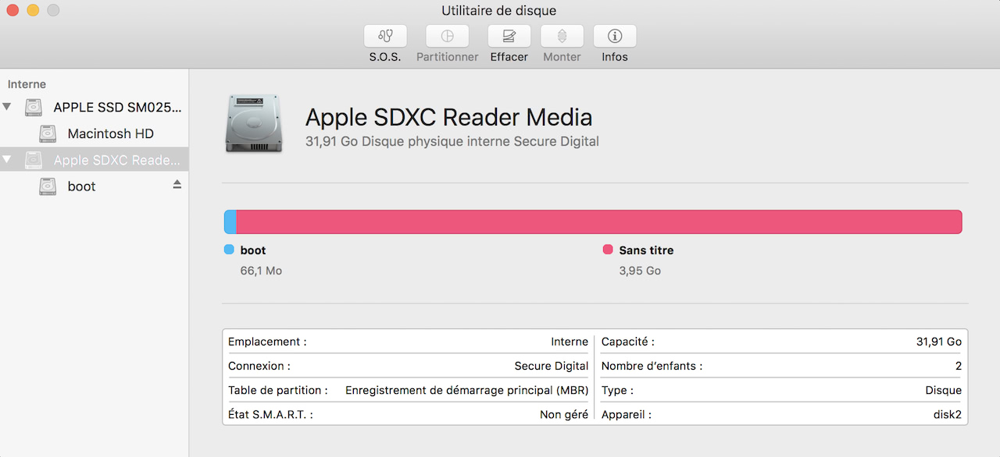
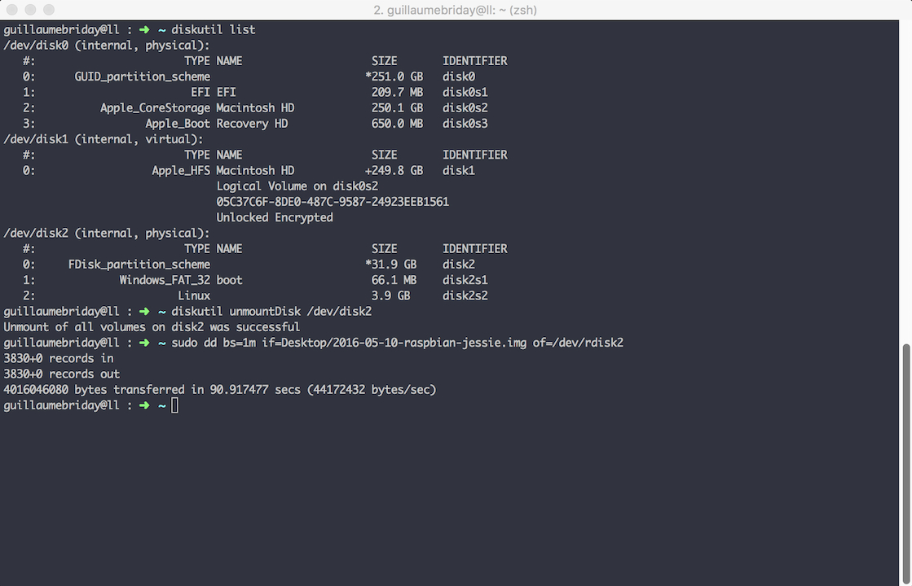
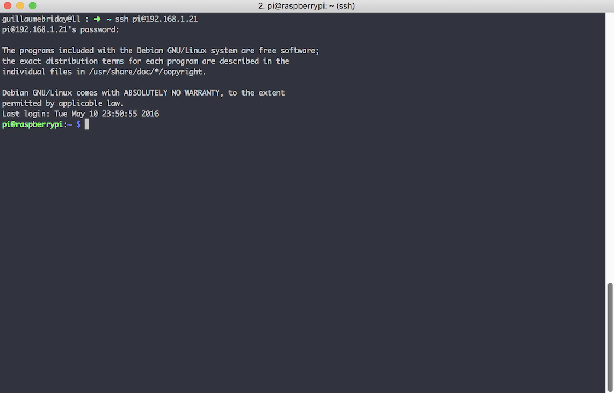
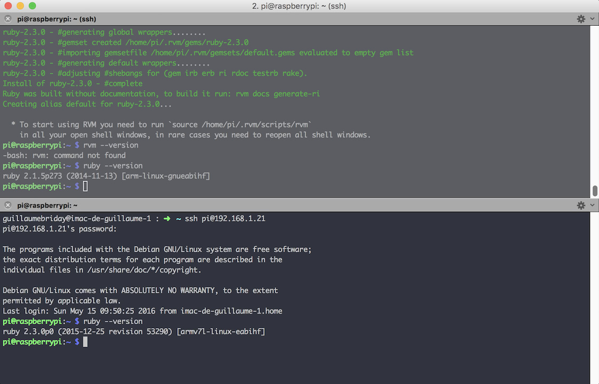

Comme vous avez pu le voir dans le titre aujourd'hui nous allons parler de Linux, et plus particulièrement de Ruby et Ruby On Rails (RoR). Je vais utiliser ici un [RPi 3 modèle B](https://fr.farnell.com/raspberry-pi/raspberrypi-modb-1gb/raspberry-pi-3-model-b/dp/2525225). Je le trouve surtout très pratique, contrairement à ses prédécesseurs, car il embarque directement un module Wi-Fi que je vais utiliser tout le temps. Ce tutoriel est réalisé un Mac et malheureusement je n'ai aucune idée de comment faire sur Windows 🤷‍♂️.

Dans l'article, c'est bien un RPi 3 qui sera utilisé mais ça marche pour n'importe quel type de serveur rassurez-vous sauf pour la partie installation de Linux bien-sûr.

## Installer Raspbian

Alors tout d'abord, il va falloir commencer par installer la distribution Linux de votre choix, de mon côté je n'ai pas voulu me compliquer plus que ça et je suis parti sur la distribution [Raspbian](https://www.raspberrypi.org/downloads/raspbian/) officielle, qui comme son nom l'indique est basé sur Debian, en version Jessie à l'heure où j'écris ces lignes. Téléchargez la version de votre choix, normale ou light, j'ai pris la version normale mais ça n'a aucune influence pour ce qu'on va en faire.

Une fois téléchargé, décompressez l'archive Zip et si vous vouliez savoir à quel moment on va manger du terminal, c'est maintenant. :-p

Avant de commencer, il faut mettre votre carte SD dans votre poste et identifier sur quel disk elle est, pour cela rien de plus simple :

```bash
$ diskutil list
```

Repérez le disk sur lequel est votre carte SD, cela peut-être par exemple `disk2` mais pas `disk2s1` qui serait alors une partition. Notez bien ce numéro qui suit `disk` !

Je vais prendre 2 comme exemple, pensez bien à adapter selon votre cas.





Démontez alors la partition de votre carte SD avec :

```bash
$ diskutil unmountDisk /dev/disk2
```

Ou cliquez sur `démonter` dans l'utilitaire de disque.
Bien, ensuite il va nous falloir copier l'image Raspbian sur la carte :
```bash
$ sudo dd bs=1m if=path/of/your/image.img of=/dev/rdisk2
```

N'oubliez pas de remplacer 2 par votre numéro, c'est important !

Pour cette étape, il n'y a aucune barre de progression ou d'indication sur le bon fonctionnement, mais s'il ne gueule pas trop dans le terminal, c'est que tout devrait bien se passer. Pour ma part la copie a mis un peu plus de 90 secondes pour se finaliser. Vous trouverez [ici](https://www.raspberrypi.org/documentation/installation/installing-images/mac.md) la document officielle, pour réaliser ces étapes, plus complète mais en anglais.



à ce moment là, vous devriez pouvoir brancher votre RPi à votre réseau local. Pour la configuration, je vous conseille d'utiliser un cable ethernet pour se passer de la connexion au Wi-Fi dans un premier temps.

Pour ce genre d'usage, je pense qu'il est très pratique de demander un bail statique à votre serveur DHCP pour être sûr de ne pas avoir à chercher l'adresse ip régulièrement.

## Configurer Raspbian

Sur votre poste maintenant, ouvrez un terminal et connectez-vous en SSH au RPi, dans mon cas l'adresse ip est `192.168.1.21` mais comme toujours adaptez selon votre cas :

```bash
$ ssh pi@192.168.1.21
```

Le mot de passe est : `raspberry`



La première chose à faire est de changer le mot de passe, c'est très important sachant qu'il est créé par défaut et donc n'importe qui connaissant votre adresse pourrait s'y connecter en SSH lui aussi, pas top voire dangereux...

Pour cela, entrez cette commande puis choisissez un nouveau mot de passe :

```bash
$ passwd
```


Une fois terminé, vous pouvez commencer par mettre vos dépendances à jour :

```bash
$ sudo apt-get update
```

C'est maintenant que les choses sérieuses commencent. La plus grosse étant que [Rails 5](https://rubygems.org/gems/rails/versions/5.0.0.rc1) a besoin de Ruby 2.2.2 ou supérieur pour fonctionner, et au moment où je vous parle, cette version de Ruby n'est pas disponible sur les repositories de Debian.

Il faut donc télécharger les sources et les compiler...

```bash
$ curl -L https://get.rvm.io | bash -s stable --ruby
```

S'il vous demande de télécharger des signatures, faites-le.

Une fois que le téléchargement et la compilation commencés, vous pouvez aller faire autre chose, vous promener, faire votre sport, visiter un autre pays, ce que vous voulez, ce sera [toujours moins long](http://31.media.tumblr.com/e21d7475a8a19ec504cb5c771898f98d/tumblr_navr43GgzW1qf9mevo1_r1_500.gif) ! :-p


Et voilà, [enfin fini](https://www.youtube.com/watch?v=hzYWzNTB8m0) pour ma part, mais attention vous allez peut-être devoir réouvrir un shell pour voir les modifications effectives ! En effet, on peut avoir de mauvaises surprises...



## Installer Rails 5.0

Vérifiez maintenant que vous avez bien une version de Ruby compatible :

```bash
$ ruby --version
```

Et installez la dernière version de rails

```bash
$ gem install rails --pre
```

Et là encore c'est long, mais il va installer toutes les dépendances nécessaires pour vous.

Même chose que pour Ruby, toujours vérifier que la version est bien la bonne :

```bash
$ rails --version
```

On va pouvoir tester si tout marche bien ! Commençons par créer un projet Rails :

```bash
$ rails new demo
$ cd demo
```

Une fois vos migrations effectuées, vous pouvez alors démarrer votre serveur rails. Pour ma part, si je veux y accéder depuis le réseau local, je dois binder le serveur sur l'ip local de mon RPi :

```bash
$ rails s -p3000 -b192.168.1.21
```

Et [boum](https://cdn.meme.am/instances/66662480.jpg) ! Tout est fonctionnel !


## Pour aller plus loin

Maintenant qu'on a notre serveur qui marche bien, je voudrais pouvoir y accéder depuis l'extérieur, comme ce qu'on pourrait attendre légitiment d'un serveur Web.

Je ne vais pas rentrer dans le détail dans cet article, mais il vous faudra configurer le NAT/PAT de votre routeur et binder les ports correspondants sur votre RPi en TCP, à savoir 3000 dans mon cas.

Accédez ensuite à votre routeur depuis son adresse publique ou bien avec un DDNS et le tour est joué.

L'ayant déjà fait, j'ai accès à mon serveur Rails de partout comme ici sur mon iPhone par exemple :


J'espère que cet article aura pu vous aider un petit peu, si vous avez des questions ou des suggestions n'hésitez surtout pas, les commentaires sont là pour ça !

Merci !
