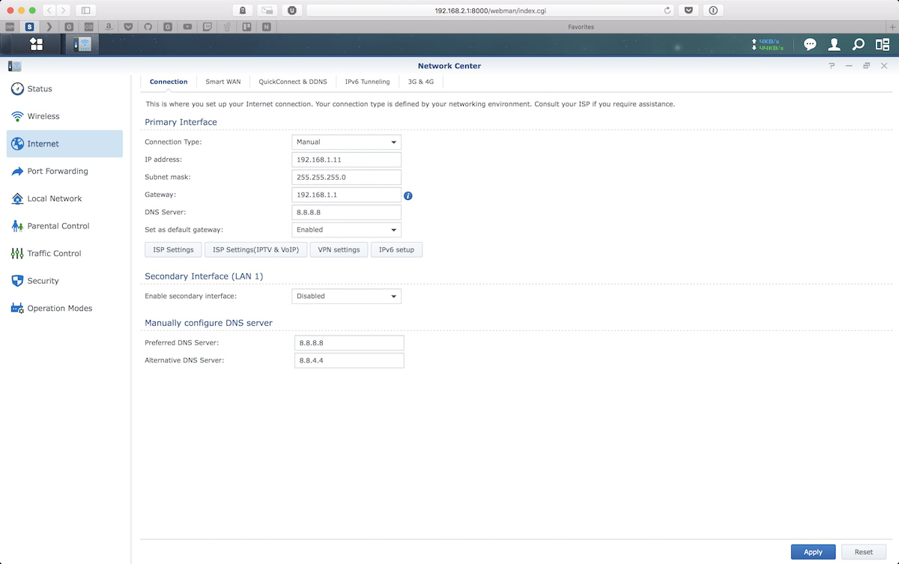
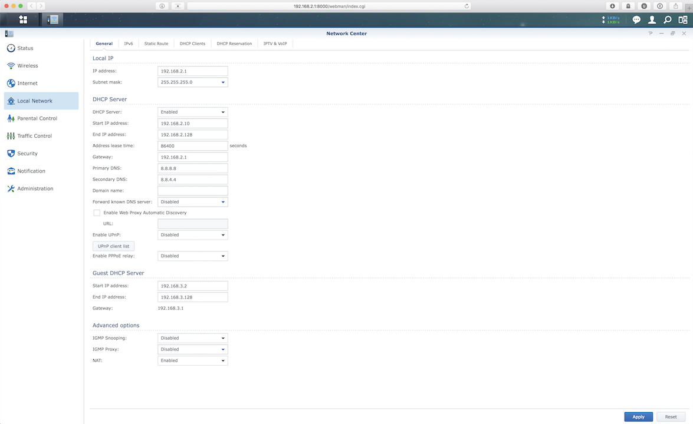

J'ai reçu, en fin de semaine, le premier routeur de Synology, le fameux [RT1900ac](https://amzn.to/2a96R85). Je ne vais pas aujourd'hui en faire un test ou un récapitulatif de ce que j'en pense, mais pour faire rapide je le trouve fantastique malgré ses petits défauts de jeunesse simplement perfectible avec des mises à jours donc je ne suis pas inquiet, il en ait toujours à ses débuts. L'interface est loin devant par rapport à la concurrence et les fonctionnalités ne manques pas.

Si vous voulez un test plus complet je vous invite à lire : [Test du routeur synology RT1900ac](https://b0b.fr/2016/02/16/test-du-routeur-synology-rt1900ac/) de Maxime Grisetto.

Aujourd'hui je vais surtout présenter comment je l'ai configuré avec une livebox 3.

## Avant de commencer

Pour remettre un peu les choses dans leurs contexte, je vais rappeler ce que je vais configurer.

Je souhaite brancher le plus d'appareils possible en ethernet pour des questions de sécurité, de fiabilité et de simplicité. J'ai la chance d'avoir chez moi des cables de tirés dans les pièces où j'ai besoin alors pourquoi s'en priver.

Entre l'iMac, le NAS, l'Apple TV et le reste ça fait du monde à brancher. Il devra y avoir un réseau Wi-Fi pour moi uniquement et un autre pour les invités.

De plus j'ai besoin d'accéder de l'extérieur à mon NAS, il devra donc y avoir les redirections nécessaires pour pour télécharger mes distributions Linux en torrent, regarder mes vidéos de vacances sur Plex ou enfin transferer mes fichiers perso en SFTP.

## Configuration de la livebox

Je souhaite que la livebox gère le moins de chose possible, mais malheureusement je ne peux pas m'en séparer complètement le routeur Synology ne faisant pas office de modem. Le livebox me servira donc uniquement à cela (ainsi que le téléphone) et l'ensemble des périphériques seront connectés au RT1900ac.

Je souhaite avoir des adresses organisées par routeur, pour faire simple, la livebox aura l'adresse `192.168.1.1` et la plage d'adresses ip du DHCP sera de `192.168.1.10` à `192.168.1.150` et oui effectivement rien n'empêchera de connecter un appareil sur un port de la livebox pour accéder au réseau.

Nous allons donc simplement brancher le port WAN du Synology à un port LAN de la livebox. Dans l'interface de la livebox, il va falloir attribuer un bail statique au routeur sur l'adresse de votre choix. Une fois fait, nous allons créer une [DMZ](https://fr.wikipedia.org/wiki/Zone_d%C3%A9militaris%C3%A9e_(informatique)) sur la même ip que le RT1900ac. La DMZ va nous permettre de redigirer tous les flux entrants vers le routeur directement donc tout sera géré sur le routeur Synology. Exactement ce qu'on voulait !

Je supprime également tout ce qui est gestion DDNS et pare-feu, je coupe le Wi-Fi et je remets la configuration par défaut du NAT/PAT.

## Configuration du RT1900ac

Bon c'est la que les choses sérieuses commencent. Je vous laisse le soin de configurer les paramètres de compte de votre routeur, nous on va juste s'occuper de la partie réseau. Mon routeur sera configuré en anglais pour toute la suite de l'article. Dans `Administration > Operation Modes` je sélectionne le mode `Wireless Router` pour être totalement dépendant de la livebox dans les réglages.

Dans l'onglet `Internet > Connection` pensez bien à mettre le `Set as default gateway` pour avoir accès à internet depuis le routeur. C'est très important, sans ça les périphériques sur votre routeur n'auront pas accès à internet, embêtant...

EDIT : En effet, dans les dernières versions de SRM cette configuration est activée par défaut s'il peut le faire, mais il faut l'activer si vous voulez accéder à internet depuis votre LAN. Les Gateways (passerelles en français) permettent de lier deux réseaux entre eux. Dans notre cas, on indique juste au RT1900ac de se comporter comme un routeur entre le WAN et notre LAN.

Ainsi, tous les appareils du réseau sauront qu'ils devront envoyer leurs paquets via ce périphérique pour accéder à internet. De la même manière, vous devez également indiquer au Synology quelle Gateway il doit utiliser pour communiquer avec l'extérieur, il faudra indiquer l'adresse ip de la livebox.

Dans mon cas, l'adresse de la DMZ est `192.168.1.11`.

C'est dans `Local Network` que la configuration va être vraiment importante. Pour la plage d'adresses ip, j'ai choisi de faire dans la continuité de la livebox donc `192.168.2.1/24`. Tous les appareils sur le Synology auront des adresses du format `192.168.2.x` et les appareils du réseau invité auront `192.168.3.x`, c'est simple à retenir et tout le monde est bien organisé dans un ordre logique.

Dans l'onglet `DHCP Reservation` , vous pouvez attribuer des adresses statiques pour vos appareils connectés, très important si vous avez besoin d'accéder à un appareil depuis l'extérieur comme nous allons le voir. Le plus simple est de sélectionner un appareil dans l'onglet `DHCP Clients` et d'utiliser le bouton `Add to address reservation` plutôt que d'entrer les informations à la main. Cliquez ensuite sur `save` et au prochain renouvellement de bail l'adresse sera alors celle réservée pour l'appareil concerné.

Synology fournit un service de DDNS, ce qui est très pratique pour accéder à son réseau local depuis l'extérieur, comme pour créer [un serveur Rails](ruby-on-rails-installation-sur-un-nas-synology-avec-docker) ou accéder à un NAS. Vous pouvez ajouter plusieurs services de DDNS et configurer la redirection de ports directement à vos appareils connectés depuis l'onglet `internet`. Rien de plus simple, il vous propose même des préréglages pour les ports et une liste de l'ensemble de vos appareils disponible, vous n'aurez plus grand chose à faire si ce n'est sélectionner selon vos besoins.

### Réseau sans fil

Pour ce qui est du réseau sans fil. J'ai créé un réseau caché en 2.4Ghz et 5Ghz avec [Smart Connect](https://www.synology.com/en-us/products/RT1900ac) pour mon usage personnel. Le WPS est `DÉSACTIVÉ` vu que le réseau est caché mais pour des questions de sécurités, il doit toujours être désactivé. Et enfin un réseau invité sur les deux bandes de fréquences pour l'ensemble des autres personnes.

## Conclusion

J'ai été aussi agréablement surpris de voir des applications comme Download Station qui permet de faire du torrent sur un Disque Dur externe. Dans le même registre, il y a File station qui vous permettra de partager le contenu d'un Disque dur en réseau ou de créer un Cloud Station facilement, ce qui pour certains évitera l'achat d'un NAS, sympa !

J'espère avoir pu aider ceux qui se posaient des questions sur la configuration d'une livebox avec ce [Synology RT1900ac](https://amzn.to/2a96R85), si vous en avez d'autres n'hésitez pas à les poser je répondrais au plus vite !

Merci :)

EDIT 2 :

Depuis une mise à jour récente sur les Synology, il y a une option pour activer le CTF. Cela permet d'avoir, dans les rapports d'activités, des statistiques très poussées sur les sites visités, les protocoles utilisés et ce genre de choses d'informations. En revanche, cela consomme beaucoup de puissance et les Synology (même les RT2600ac) ne sont pas calibrés pour gérer des débits très important avec cette option.

J'ai la fibre 1Go et j'observe une baisse de débit considérable lorsque j'active l'option. Si votre connexion ne le permet pas, vous pouvez utiliser cette fonctionnalité sans compromis, sinon vous devrez choisir entre les statistiques et une connexion vraiment fibrée. L'exemple en image que j'ai publié sur twitter :

https://twitter.com/guillaumebriday/status/914550113795796993
