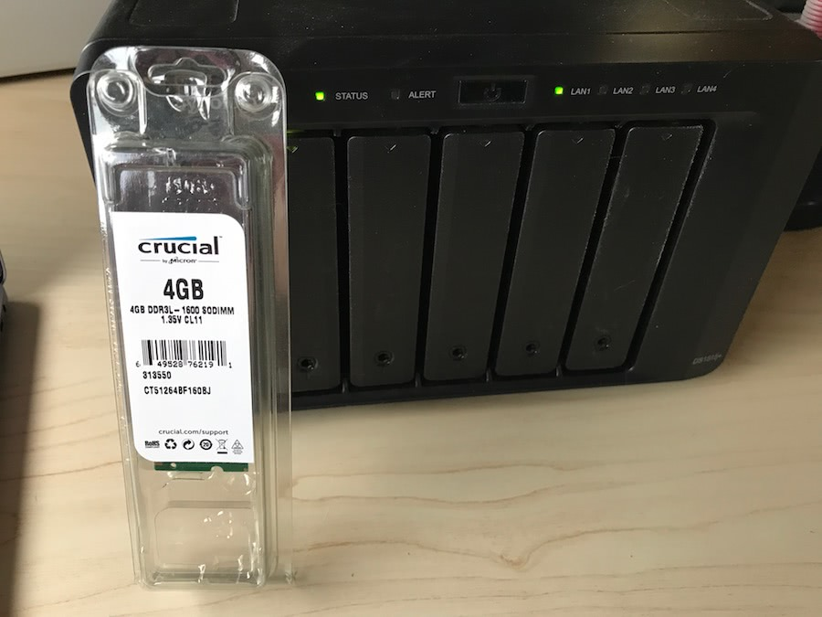
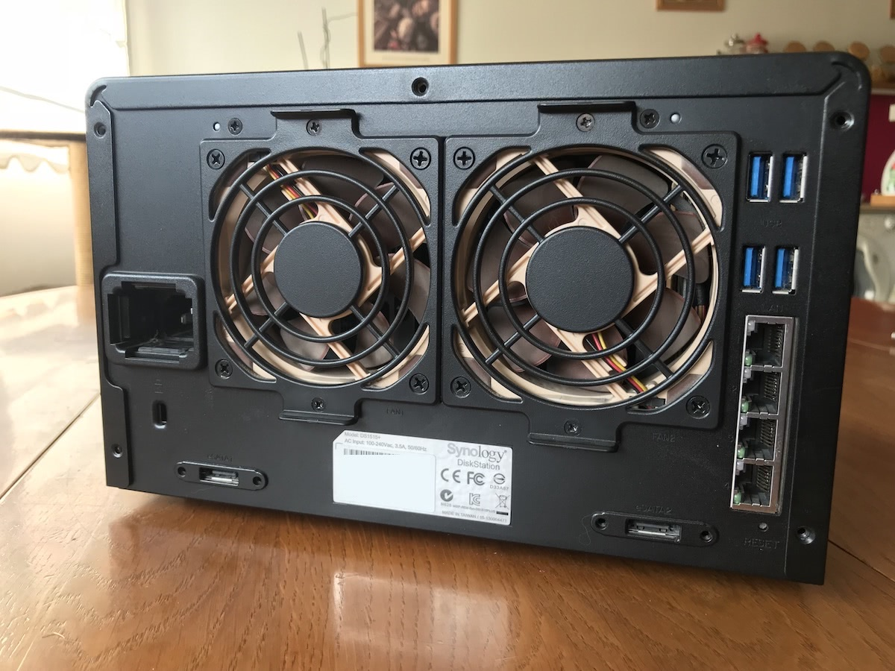
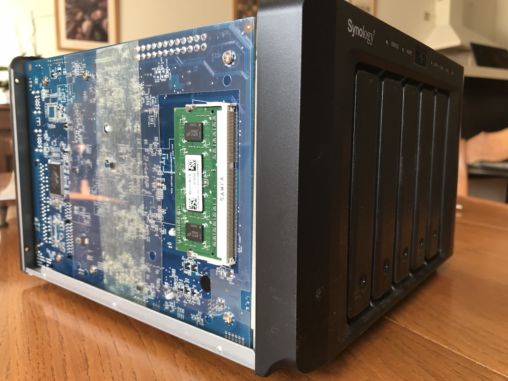
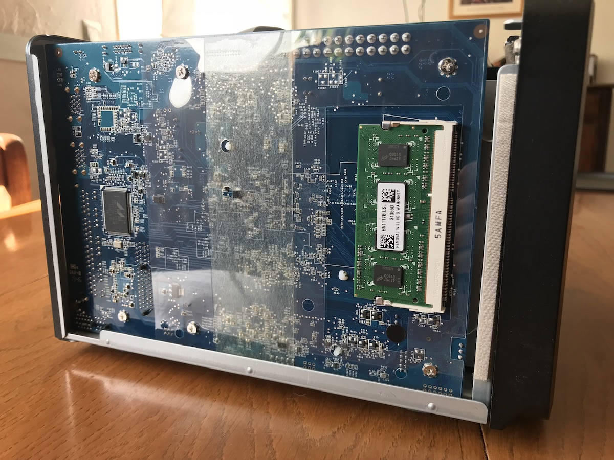

Comme j'ai pu en parler sur le blog, j'ai un [NAS Synology 1515+](http://amzn.to/2xtjCSv), c'est une petite merveille et je m'en sers absolument tout le temps. Depuis un moment maintenant, ce NAS a remplacé en grande partie les outils que j'utilisais au quotidien. Pour ne citer qu'eux, il y a [Dropbox](https://db.tt/9QPHDw69), les outils Google (Calendrier, contacts, Office, etc.), [Transmission](https://transmissionbt.com) et j'en passe.

Tous ces logiciels sont vraiment géniaux et me permettent, sans compromis, d'avoir un Cloud complet et auto-hébergé. De plus, avec l'arrivée de [Docker](https://www.docker.com) sur DSM, je peux installer absolument tout ce que je souhaite ! Je peux même faire mes propres application Web comme si j'avais un VPS chez un hébergeur externe. Le revers de la médaille est que la consommation moyenne de la RAM augmente toujours plus !

## Quelles quantités et modèles sont disponibles ?

Les modèles de cette gamme Synology sont livrés par défaut avec 2Go de RAM, ce qui est déjà assez conséquent pour un NAS avec une utilisation normale. Il y a eu un changement majeur entre les modèles de 2015 et 2017.

En 2015, nous avions 2Go par défaut avec un seul slot de RAM vide disponible et un maximum total de 8Go. En 2017, deux versions sont proposées pour le modèle 1517+, une version avec 2Go et avec 8Go, avec également un slot de RAM pour augmenter la capacité jusqu'à 16Go cette fois-ci.

Donc pour le 1515+, il faut obligatoirement une seule nouvelle barrette de 4Go, les spécifications techniques sont disponibles en détails sur le [site officiel](https://www.synology.com/en-us/products/DDR3). Pour nous ce sera donc de la ```DDR3-1600 unbuffered SO-DIMM 204pin 1.35V/1.5```.

Je me suis tourné chez [Crucial](http://amzn.to/2wL0yli) pour trouver ma barrette, car j'ai toujours eu une bonne expérience avec leurs produits.



## Installation de la barrette

Pour cette partie, il va falloir enlever la partie supérieure du NAS, car l'emplacement de la barrette se trouve à l'intérieur. Avant de commencer, éteignez votre complètement NAS et débranchez le du secteur. Une fois fait, il va falloir dévisser cinq petites vises à l'arrière de l'appareil qui maintiennent la coque supérieure.



Une fois la partie supérieure retirée, on trouvera sur la gauche de l'appareil un emplacement pour la RAM. Il suffit alors de pousser la barrette dans le bon sens jusqu'à entendre un petit **clic**. Et c'est tout, il n'y a rien de plus à faire.





Avant de remonter tout le panneau, vous pouvez (en faisant attention) rebrancher votre NAS et le rallumer pour voir s'il détecte bien votre nouvelle barrette. En cas de problème, vous n'aurez pas à tout redémonter. En revanche, éteignez bien votre NAS une nouvelle fois avant de remettre la barrette dans le cas où tout marcherait correctement.

Si la barrette est mal positionnée, le NAS ne pourra pas démarrer et fera un **bip** régulièrement. Si le NAS démarre, on pourra aller voir dans le centre d'information s'il y a bien ```6 Go``` d'indiqué.

Avec cet upgrade, je dépasse rarement les 50 % d'utilisation de la mémoire, ce qui me laisse une certaine marge avant de me sentir vraiment limité dans mon usage. En revanche, si vous n'êtes pas souvent au-delà des 80 % ou 90 % d'utilisation, ajouter de la RAM n'a aucun intérêt, ça ne changera rien au niveau des performances.

Merci !
