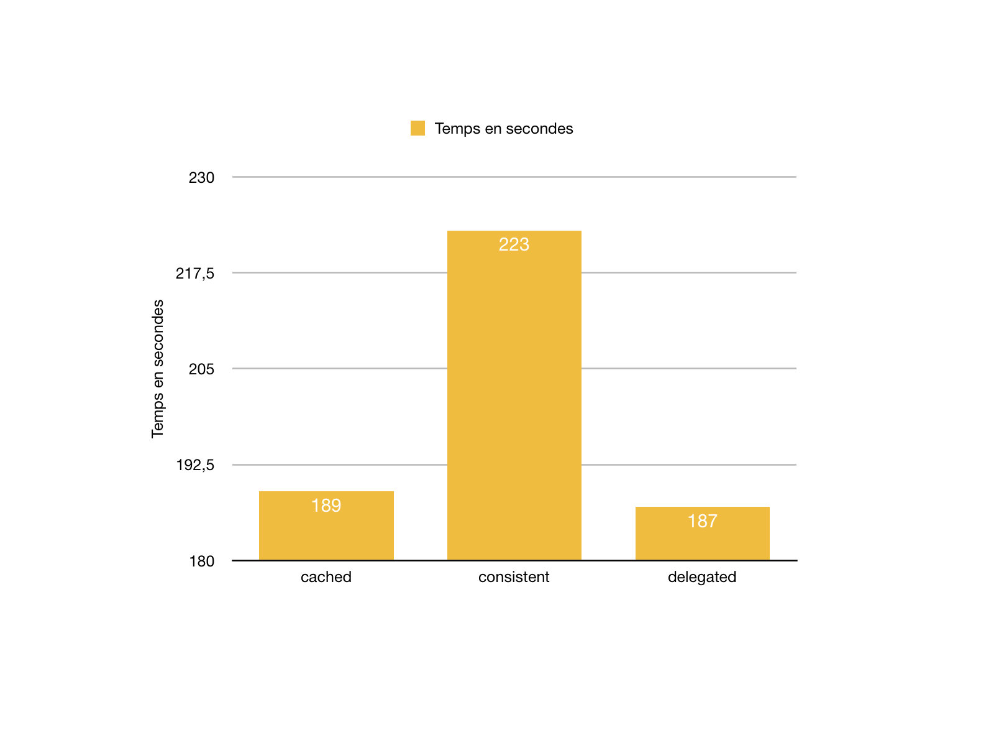
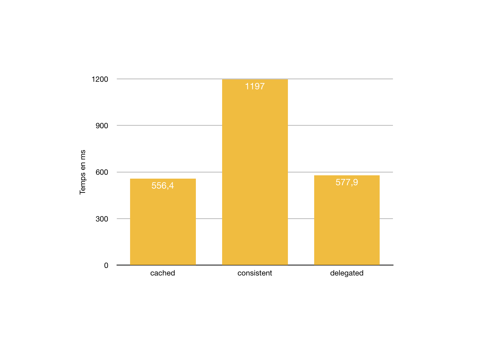

Nous allons aujourd'hui parler du fonctionnement de Docker sur macOS et de l'optimisation que l'on peut faire grâce au cache.

Avant d'aller plus loin dans ce chapitre, il est important de comprendre comment Docker fonctionne sur macOS et Windows.

Docker ne fonctionne que sur le système d'exploitation Linux, il ne fonctionne pas sur macOS ni sur Windows nativement. Pour pouvoir s'en servir sur macOS, l'application [Docker for Mac](https://www.docker.com/docker-mac#/features) va installer pour vous un Linux minimaliste dans une machine virtuelle grâce à l'[hyperviseur natif](https://developer.apple.com/documentation/hypervisor) de macOS, disponible depuis OS X Yosemite (10.10), et [HyperKit](https://github.com/moby/hyperkit). Le principe est le même sur Windows avec Hyper-V.

Docker et Docker-compose vont alors s'installer directement dans cette machine virtuelle. Toutes les commandes, les réseaux et données seront alors automatiquement transférés entre notre host et la machine virtuelle. Vous trouverez plus d'informations dans l'[article officiel](https://blog.docker.com/2016/05/docker-unikernels-open-source/) d'Anil Madhavapeddy.

Pour transférer les données entre votre host et la machine virtuelle, c'est [osxfs](https://docs.docker.com/docker-for-mac/osxfs/) qui en a la charge. Malheureusement, osxfs souffre encore de gros problèmes de performances et les développeurs en sont [bien conscients](https://docs.docker.com/docker-for-mac/osxfs/#performance-issues-solutions-and-roadmap) et ont commencé à mettre en place des solutions. L'article explique clairement pourquoi il y a ces problématiques sur macOS.

La mise en place d'un cache est désormais disponible et elle présente une solution intéressante le temps d'une mise à jour d'osxfs qui permettra d'avoir des performances similaires à celle sur Linux. En effet, les performances d'une application conteneurisée sur Linux sont presque les mêmes que sur un host Linux.

Il existe trois options possibles pour mettre en place ce cache :

+ ```delegated``` : les données dans le container sont prédominantes sur celle de l'host, il y a donc un délais entre ce qu'il se passe dans le container et ce qui est sauvegardé sur l'host. Permet d'augmenter les vitesses d'*écriture*.

+ ```cached``` : les données sur l'host sont prédominantes sur celles dans le container, il y a donc un délais entre ce qu'il se passe sur l'host et ce qui est envoyé dans le container. Permet d'augmenter les vitesses de *lecture*.

+ ```consistent``` : paramètre par défaut, il permet de garder une parfaite consistance de vos données entre l'host et les containers.

Il n'y a pas une option meilleure qu'une autre, cela dépend de vos besoins.

Comme il l'est également précisé dans la documentation, l'option ```delegated``` est disponible mais pas encore complètement abouti, il ne faut donc pas s'attendre à un écart important avec ```cached```.

**Attention !** Il faut noter que ```delegated``` et ```cached``` autorisent une perte des données en cas de problèmes.

Heureusement, on a pas toujours besoin d'avoir une consistance parfaite de nos données. Par exemple, sur mon environnement de développement je vais être souvent amené à lire des informations de la base de données mais beaucoup moins à en écrire. Il faut que les performances soit le plus rapide possible en lecture et tant pis pour la consistance de mes données.

En production, la problématique ne se pose pas car j'utilise un environnement Linux, en revanche j'aurais laissé le comportement par défaut car on ne peut pas se permettre de perdre de l'information.

Dans votre ```docker-compose.yml```, il suffit d'ajouter l'option à la fin de la déclaration de votre volume:

```diff
services:
  blog-server:
    volumes:
-      - ./:/application
+      - ./:/application:cached
```

Ou avec Docker directement par exemple :

```bash
$ docker run -v $(pwd):/application:cached -d laravel-blog
```

## Quelques tests

Rien de scientifique ou de super précis pour ces essais, c'est surtout pour donner un ordre d'idée, mais à l'usage la différence est flagrante.

### Composer install

```bash
$ docker run -it --rm -v $(pwd):/app composer/composer install
```



### Chargement d'une page d'accueil
J'ai calculé la moyenne du temps de chargement de la page d'accueil de laravel-blog, avec dix chargements :



On remarque une nette amélioration avec l'utilisation de ```cached``` et ```delegated```. On obtient une diminution de presque **54 %** des temps de chargement.

J'espère qu'il y aura d'autres améliorations rapidement, en attendant je pense que c'est bon compromis.

Merci !
