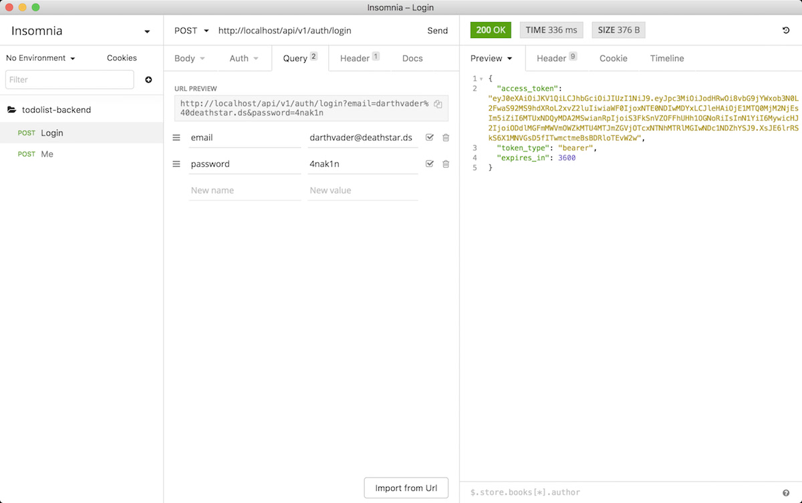
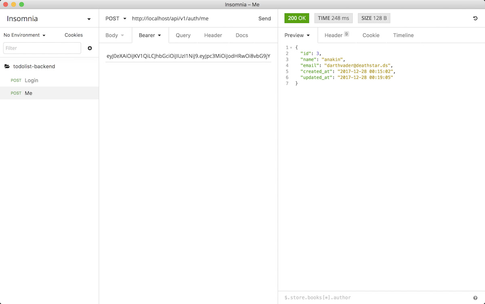

Avant de commencer à développer les fonctionnalités de notre application, il va falloir mettre en place l'authentification. Pour ce projet, j'utilise les JWT.

L'article n'a pas pour but de présenter le fonctionnement des JWT. Si vous voulez en savoir plus, je vous invite à regarder la présentation de [Grafikart](https://www.grafikart.fr/tutoriels/divers/json-web-token-presentation-958) à ce sujet qui m'a beaucoup aidé.

Comme je l'ai dit dans l'article de présentation, je vais utiliser un package tout prêt pour implémenter les JWT avec Laravel : [tymondesigns/jwt-auth](https://github.com/tymondesigns/jwt-auth).

À l'heure où j'écris cet article, la version 1.0.0 est en Release Candidate, cela veut dire qu'il n'y aura pas de modification de comportement d'ici la sortie officielle, mais seulement des corrections de bugs. Je vous conseille vraiment d'utiliser la version 1.0.0 car il y a beaucoup de modifications par rapport à la version en cours.

Ce package propose deux choses intéressantes. La première, c'est qu'il utilise la fonction ```Package Discovery``` disponible depuis [Laravel 5.5](https://laravel.com/docs/5.5/releases#laravel-5.5), cela ne change rien au fonctionnement du package mais c'est très pratique.

La seconde fonctionnalité beaucoup plus importante, c'est son implémentation direct dans le système d'authentification de Laravel. Autrement dit, nous n'avons presque aucune configuration à faire pour l'utiliser, tout sera géré par le package et Laravel.

## Installation

```bash
$ composer require tymon/jwt-auth:dev-develop
```

Je précise la version ```dev-develop``` pour avoir la ```Release Candidate```, il faudra enlever cette précision quand la version finale sera disponible.

Pour créer le fichier de configuration, il suffit de lancer la commande :

```bash
$ php artisan vendor:publish --provider="Tymon\JWTAuth\Providers\LaravelServiceProvider"
```

C'est dans ce fichier que vous pourrez modifier, entre autre, le temps de vie des tokens ou l'algorithme à utiliser pour sécuriser vos tokens.

Pour pouvoir hasher les tokens, il va falloir générer une clé, comme le fait Laravel pour les cookies avec ```APP_KEY```. Ici la clé s'appelle ```JWT_SECRET``` et se génère avec la commande :

```bash
$ php artisan jwt:secret
```

## Configuration du model

L'avantage d'utiliser le système d'authentification de Laravel, c'est qu'il n'y a presque pas de modification du model à effectuer.

Vous devez rajouter deux méthodes que le package va devoir utiliser dans la classe ```User``` et implémenter la classe ```JWTSubject```.

```diff
<?php

namespace App;

use Illuminate\Foundation\Auth\User as Authenticatable;
use Illuminate\Notifications\Notifiable;
+ use Tymon\JWTAuth\Contracts\JWTSubject;

- class User extends Authenticatable
+ class User extends Authenticatable implements JWTSubject
{
    use Notifiable;

    // Reste de la classe

+   /**
+    * Get the identifier that will be stored in the subject claim of the JWT.
+    *
+    * @return mixed
+    */
+   public function getJWTIdentifier()
+   {
+       return $this->getKey();
+   }

+   /**
+    * Return a key value array, containing any custom claims to be added to the JWT.
+    *
+    * @return array
+    */
+   public function getJWTCustomClaims()
+   {
+       return [];
+   }
}
```

Et c'est tout. Il n'y a pas de migration à faire puisque toutes les informations nécessaires seront sauvegardées dans le token directement.

## Configuration de l'authentification pour Laravel

Dans le fichier ```config/auth.php```, il va falloir faire quelques modifications pour ne plus utiliser le système de token de Laravel, mais celui des JWT. De plus, le ```guard``` par défaut ne sera plus celui utilisé en ```web```, mais en ```api```.

Le ```guard``` est le type d'authentification que va utiliser Laravel. Si c'est ```web```, il utilisera les sessions PHP traditionnelles, si c'est api, par défaut, il utilisera les ```token``` qu'il faut rajouter dans une colonne ```api_token``` dans ```User```. C'est d'ailleurs ce que j'utilise dans ```laravel-blog``` dans [ce fichier de migration](https://github.com/guillaumebriday/laravel-blog/blob/137979352a59a67d557e5827e22fe0b1eea86fb0/database/migrations/2017_03_25_194948_add_api_token_to_users_table.php).

Pour utiliser par défaut le guard des ```api``` avec les JWT :

```diff
# config/auth.php

'defaults' => [
-   'guard' => 'web',
+   'guard' => 'api',
    'passwords' => 'users',
],

// ... Suite du fichier

'guards' => [
    'web' => [
        'driver' => 'session',
        'provider' => 'users',
    ],

    'api' => [
-       'driver' => 'token',
+       'driver' => 'jwt',
        'provider' => 'users',
    ],
],
```

## Créer un controller d'authentification

On parle ici uniquement d'authentification. En effet, la partie création d'un utilisateur reste standard et n'est pas spécifique au JWT.

Avant de créer notre controller, nous allons préparer nos API à être versionnées.

Le concept est très simple, tous nos controllers seront dans un namespace spécifique nommé en fonction du numéro de version, par exemple ```App\Http\Controllers\V1``` pour la version 1 et ainsi de suite pour toutes les versions ultérieures. Les routes seront également préfixées par le numéro de version et elles appelleront les controllers correspondants.

Une fois les développements terminés pour la première version, nous ferons un nouveau namespace pour la version 2 et un nouveau préfixe pour les routes.

On pourrait avoir un dossier qui ressemblerait à ceci :

```
├── Controllers
│   ├── V1
│   │   ├── Auth
│   │   │   └── AuthController.php
│   │   ├── TasksController.php
│   │   └── UsersController.php
│   ├── V2
│   │   ├── Auth
│   │   │   └── AuthController.php
│   │   ├── TasksController.php
│   │   └── UsersController.php
│   └── Controller.php
```

**Versionner est important, car il nous permettra d'assurer aux clients de notre API que le comportement ne changera pas pour une url donnée.**

En effet, si dans la seconde version, le JSON renvoyé pour la liste des tâches n'est plus le même que dans la première version, les clients ne s'attendraient pas à recevoir ce format et les applications ne marcheraient plus.

Avec un système de version, on permet aux anciens clients de migrer, dès qu'ils le pourront, vers une version plus à jour des API et aux nouveaux de profiter des dernières nouveautés de nos API.

La documentation nous fournit un controller prêt à l'emploi. Dans mon cas, je préfère le placer dans un sous-dossier ```Auth``` qui accueillera tous les controller liés à la gestion des comptes.

```php
<?php

namespace App\Http\Controllers\V1\Auth;

use App\Http\Controllers\Controller;
use Illuminate\Http\Request;
use Illuminate\Support\Facades\Auth;

class AuthController extends Controller
{
    /**
     * Create a new AuthController instance.
     *
     * @return void
     */
    public function __construct()
    {
        $this->middleware('auth:api', ['except' => ['login']]);
    }

    /**
     * Get a JWT token via given credentials.
     *
     * @param  \Illuminate\Http\Request  $request
     *
     * @return \Illuminate\Http\JsonResponse
     */
    public function login(Request $request)
    {
        $credentials = $request->only('email', 'password');

        if ($token = $this->guard()->attempt($credentials)) {
            return $this->respondWithToken($token);
        }

        return response()->json(['error' => 'Unauthorized'], 401);
    }

    /**
     * Get the authenticated User
     *
     * @return \Illuminate\Http\JsonResponse
     */
    public function me()
    {
        return response()->json($this->guard()->user());
    }

    /**
     * Log the user out (Invalidate the token)
     *
     * @return \Illuminate\Http\JsonResponse
     */
    public function logout()
    {
        $this->guard()->logout();

        return response()->json(['message' => 'Successfully logged out']);
    }

    /**
     * Refresh a token.
     *
     * @return \Illuminate\Http\JsonResponse
     */
    public function refresh()
    {
        return $this->respondWithToken($this->guard()->refresh());
    }

    /**
     * Get the token array structure.
     *
     * @param  string $token
     *
     * @return \Illuminate\Http\JsonResponse
     */
    protected function respondWithToken($token)
    {
        return response()->json([
            'access_token' => $token,
            'token_type' => 'bearer',
            'expires_in' => $this->guard()->factory()->getTTL() * 60
        ]);
    }

    /**
     * Get the guard to be used during authentication.
     *
     * @return \Illuminate\Contracts\Auth\Guard
     */
    public function guard()
    {
        return Auth::guard();
    }
}
```

On remarque qu'il y a un middleware qui utilise l'authentification native de Laravel pour vérifier si un utilisateur est connecté sauf, évidemment, pour la connexion de celui-ci.

## Les routes

On va définir un groupe qui sera préfixé par ```v1``` et qui utilisera les namespaces ```V1```. Je fais un sous-groupe spécifique à l'authentification pour y ajouter un préfixe et surtout un namespace.

On pourra faire, plus tard, un groupe pour la version 2.

```php
Route::prefix('v1')->namespace('V1')->group(function () {
    Route::prefix('auth')->namespace('Auth')->group(function () {
        Route::post('login', 'AuthController@login');
        Route::post('logout', 'AuthController@logout');
        Route::post('refresh', 'AuthController@refresh');
        Route::post('me', 'AuthController@me');
    });

    # Reste de nos routes pour la V1
});

// Route::prefix('v2')->namespace('V2')->group(function () {
    // Nos routes pour la V2
// });
```

## Générer et utiliser un token

Maintenant que tout a été configuré, on va pouvoir générer et utiliser nos tokens.

N'ayant pas encore mis en place le système de création d'utilisateur, je vais utiliser [tinker](https://laravel.com/docs/5.5/artisan#introduction).

```bash
$ docker-compose run --rm todolist-server php artisan tinker
>>> App\User::create(['name' => 'anakin', 'email' => 'darthvader@deathstar.ds', 'password' => bcrypt('4nak1n')]);
=> App\User {#819
     name: "anakin",
     email: "darthvader@deathstar.ds",
     updated_at: "2017-12-28 00:15:02",
     created_at: "2017-12-28 00:15:02",
     id: 3,
   }
```

Pour générer un token, il suffit d'envoyer son ```email``` et son ```password```. Je vais utiliser [insomnia](https://insomnia.rest) qui est un super outil open-source et gratuit pour faire des requêtes HTTP, mais vous pouvez utiliser [Postman](https://www.getpostman.com) si vous y êtes plus habitué.



On peut essayer de mettre des identifiants incorrectes et nous recevrons alors une erreur ```401: Unauthorized```.

Si les identifiants sont corrects, on reçoit alors notre token que nous pouvons utiliser pour nous connecter :



De la même manière, si on enlève le JWT de la requête, on obtient la même erreur que plus haut, le middleware fonctionne donc comme attendu !

Attention, il faut penser à rajouter le header ```X-Requested-With``` avec la valeur ```XMLHttpRequest``` pour que Laravel comprenne que nous faisons une requête AJAX.

## Conclusion

A partir de maintenant, pour toutes les requêtes de notre application, nous devrons rajouter le token pour pouvoir être connecté jusqu'à son expiration au bout d'une heure mais renouvelable pendant deux semaines.

Si vous avez des questions, n'hésitez pas ! Je mets le dépôts GitHub à jour dès que possible.
